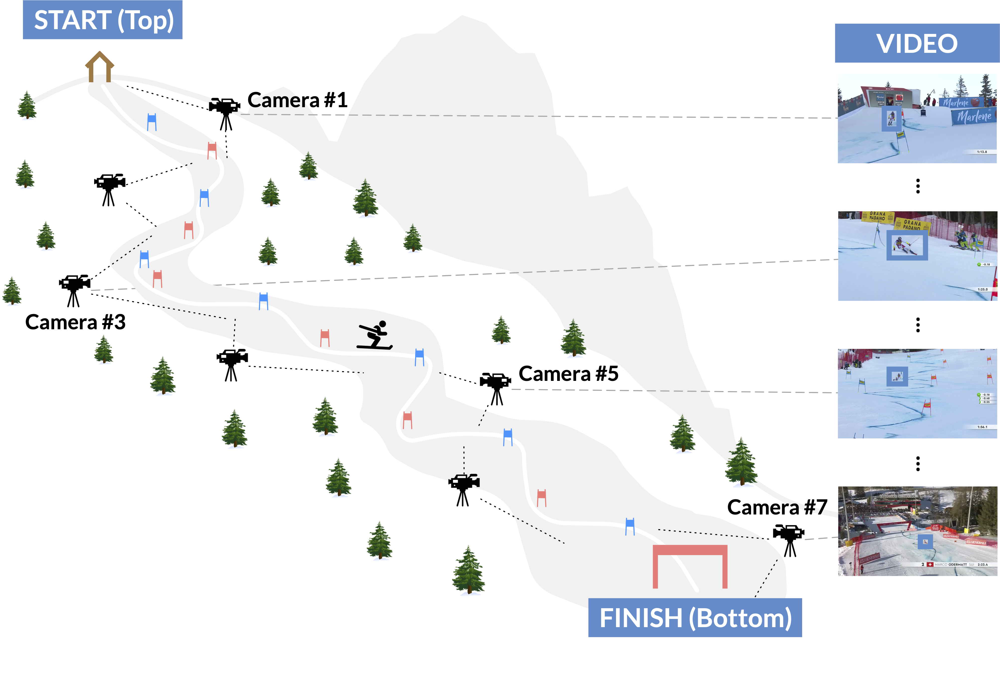

# [Tracking Skiers from the Top to the Bottom](https://machinelearning.uniud.it/datasets/skitb/)
## The SkiTB Dataset and Toolkit

<!-- start badges -->
[](https://arxiv.org/abs/2312.09723)
<!-- end badges -->



> Skiing is a popular winter sport discipline with a long history of competitive events. In this domain, computer vision has the potential to enhance the understanding of athletes’ performance, but its application lags behind other sports due to limited studies and datasets. Our paper makes a step forward in filling such gaps. A thorough investigation is performed on the task of skier tracking in a video capturing his/her complete performance. Obtaining continuous and accurate skier localization is preemptive for further higher-level performance analyses. To enable our study, the largest and most annotated dataset for computer vision in skiing, SkiTB, is introduced. Several visual object tracking algorithms, including both established methodologies and a newly introduced skier-optimized baseline algorithm, are tested using the dataset. The results provide valuable insights into the applicability of different tracking methods for vision-based skiing analysis.

## Authors
Matteo Dunnhofer
Luca Sordi
Niki Martinel 
Christian Micheloni 

* Machine Learning and Perception Lab, University of Udine, Italy

**Contact:** [matteo.dunnhofer@uniud.it](mailto:matteo.dunnhofer@uniud.it)


## Citing
When using the dataset or toolkit, please reference:

```
@InProceedings{SkiTBwacv,
  author = {Dunnhofer, Matteo and Sordi, Luca and Martinel, Niki and Micheloni, Christian},
  title = {Tracking Skiers from the Top to the Bottom},
  booktitle = {Proceedings of the IEEE/CVF Winter Conference on Applications of Computer Vision (WACV)},
  month = {Jan},
  year = {2024}
}

@article{SkiTBcviu,
  title = {Visual tracking in camera-switching outdoor sport videos: Benchmark and baselines for skiing},
  journal = {Computer Vision and Image Understanding},
  volume = {243},
  pages = {103978},
  year = {2024},
  doi = {https://doi.org/10.1016/j.cviu.2024.103978},
}
```

## The SkiTB Dataset

The data and annotations for this dataset are contained in this folder.

The main dataset directory contains 3 folders: ```AL```, ```JP```, ```FS```. Each of these presents 100 folders containing the multi-camera (MC) videos capturing the complete performance of alpine skiing athletes (```AL```), ski jumping athletes (```JP```), and freestyle skiing athletes (```FS```).
In each of such 3 folders, there also the following files:
 - ```*_data.csv```: Contains the metadata (athlete ID, course location, weather condition, athlete performance, results, etc.) for each of 100 MC videos.
 - ```*_train_test_date_60-40.json```: Contains the MC videos IDs separated in training and test set according to the date of the skiing competition.
 - ```*_train_test_athlete_60-40.json```: Contains the MC videos IDs separated in training and test set to have disjoint sets of athletes.
 - ```*_train_test_course_60-40.json```: Contains the MC videos IDs separated in training and test set to have disjoint sets of course locations.
  - ```*_train_val_test_date_60-40.json```: Contains the MC videos IDs separated in training, validation, and test set according to the date of the skiing competition.
 - ```*_train_val_test_athlete_60-40.json```: Contains the MC videos IDs separated in training, validation, and test set to have disjoint sets of athletes.
 - ```*_train_val_test_course_60-40.json```: Contains the MC videos IDs separated in training, validation, and test set to have disjoint sets of course locations.
 - ```*_visual_attributes.csv```: Contains the visual attributes (CM, FOC, SC, LR, etc.) for each of the SC clips extracted by the MC clips belonging to the test set specified in ```*_train_test_date_60-40.json```.

Each of 100 MC sequence folder will contain the directories:
 - ```frames/```: Contains the video frames of the sequence as ```*.jpg``` files.
 - ```MC/```: Contains the frame annotation files of the sequence of MC setting.
 - ```SC/```: Contains a serie of folders for each of the clips composing the MC videos (single-camera, SC, setting).

The ```MC/``` folder contains the following files:
 - ```boxes.txt```: Contains the ground-truth trajectory of the target object. The comma-separated values on each line represent the bounding-box locations [x,y,w,h] (coordinates of the top-left corner, and width and height) of the target object at each respective frame (1st line -> target location for the 1st frame, last line -> target location for the last frame). 
 - ```frames.txt```: Contains the frame indices of the sequence with respect to the full mp4 video. 
 - ```visibilities.txt```: Contains the occlusion levels for the bounding-box for each frame. A value of ```1``` means that more than the 50% of the skier's visual appearance is visible in the frame. A value of ```0``` means the opposite.
 - ```cameras.txt```: Contains the indices of the cameras that acquired the frames. The indices are in an increasing order with ```0``` being the camera that captured the start of the skiing performance (at the Top of the course), and the last value is the index of the camera that acquired the end of the performance (at the Bottom of the course). Please refer to Figure 1 of the WACV paper for further clarifications.

 The ```SC/``` folder contains a sequence of folders where each one refers to SC clip acquired by a single videocamera. The name of each folder is the index of the camera considering the ordering of teh cameras from the Top to the Bottom of the skiing course (Please refere to Figure 1 of the WACV paper for further clarifications). Each of such folders contains the following files:
- ```boxes.txt```: Contains the ground-truth trajectory of the target object for the SC clip. The comma-separated values on each line represent the bounding-box locations [x,y,w,h] (coordinates of the top-left corner, and width and height) of the target object at each respective frame (1st line -> target location for the 1st frame, last line -> target location for the last frame). 
 - ```frames.txt```: Contains the frame indices of the SC sequence with respect to the full mp4 video. 
 - ```visibilities.txt```: Contains the occlusion levels for the bounding-box for each frame of the SC sequence. A value of ```1``` means that the more than the 50% of the skier's visual appearance is visible in the frame. A value of ```0``` means the opposite.
 

## Toolkit
The code available in this repository allows you to replicate the experiments and results presented in our paper. Our code is built upon the [```got10k-toolkit```](https://github.com/got-10k/toolkit) toolkit and inherits the same tracker definition. Please check such a GitHub repository to learn how to use our toolkit. The only difference is that you have to change the name of the toolkit when importing the python sources (e.g. you have to use ```from toolkit.experiments import ExperimentSkiTB``` instead of ```from got10k.experiments import ExperimentSkiTB```). Otherwise, you can try to integrate the orginal ```got10k-toolkit``` with the sources of this repository (it should be easy).

In the following, we provide examplar code to run an evaluation of the [SiamFC tracker](https://github.com/got-10k/siamfc) on the SkiTB benchmark.
```
git clone https://github.com/matteo-dunnhofer/SkiTB-toolkit
cd SkiTB-toolkit

# Clone a the GOT-10k pre-trained SiamFC
pip install torch opencv-python got10k
git clone https://github.com/matteo-dunnhofer/siamfc-pytorch.git siamfc_pytorch
mkdir siamfc_pytorch/pretrained
wget -nc --no-check-certificate "https://drive.google.com/uc?export=download&id=1UdxuBQ1qtisoWYFZxLgMFJ9mJtGVw6n4" -O siamfc_pytorch/pretrained/siamfc_alexnet_e50.pth
      
python example_skitb.py --discipline AL # for running on the whole set of videos related to alpine skiing
python example_skitb.py --discipline JP # for running on the whole set of videos related to ski jumping
python example_skitb.py --discipline FS # for running on the whole set of videos related to freestyle skiing

python example_skitb.py --discipline AL --split-file [path-to-json-split-file-in-SkiTB] --split test # for running on the test set of videos related to alpine skiing
```
In order for this code to work, the SkiTB dataset should be downloaded from [this link](https://forms.office.com/Pages/ResponsePage.aspx?id=Fd5qbmwpJEKsWByOwv1TqGZ0FiFPXjFKh2JII46hSYhUMVQ2RE0yS0FMMEhFSVNWNUxNWks3M0hYSy4u), unpacked, and put in the ```SkiTB-toolkit``` folder. The dataset can be also stored in another location but in that case line 16 of ```example_skitb.py``` should be changed to point to the dataset's main folder.


## Tracker Results
The raw results of the trackers benchmarked in our paper can be downloaded from [this link](https://uniudamce-my.sharepoint.com/:u:/g/personal/matteo_dunnhofer_uniud_it/EVU0aGZmYYlLnOBBCJaAF6EBV7OCYnvSr91KajjA5i91Gg?e=NOm3h0).


## The SkiTB Visual Tracking Challenge
We will host SkiTB Visual Tracking Challenge in conjunction with the [3rd Workshop on Computer Vision for Winter Sports](https://sites.google.com/unitn.it/cv4ws-wacv2025/) held at the [IEEE/CVF Winter Conference on Applications of Computer Vision (WACV) 2025](https://wacv2025.thecvf.com). For instructions on how to participate, please see the [challenge's platform on CodaLab](https://codalab.lisn.upsaclay.fr/competitions/20897). This toolkit can be used to generate submissions for the challenge. Specifically, after running your tracker on the test videos of all the AL, JP, FS disciplines as explained above, you can use the script ```export_results_skitb_visual_tracking_challenge.py``` to generate the zipped JSON that can be submitted to the platform. The following steps give a sense to what you have to do to obtain the submission for the challenge:
```
# Download the toolkit, install repositories, and implement your tracker
# ...

# Run your tracker on all the videos of the date-based test split
python example_skitb.py --discipline AL --split-file [path-to-AL_train_val_test_date_60-40.json] --split test 
python example_skitb.py --discipline JP --split-file [path-to-JP_train_val_test_date_60-40.json] --split test 
python example_skitb.py --discipline FS --split-file [path-to-FS_train_val_test_date_60-40.json] --split test 

# Pack the results for the challenge
python export_results_skitb_visual_tracking_challenge.py
```


## License
All annotation files in this dataset and the source code files are copyright by us and published under the Creative Commons Attribution-NonCommercial 4.0 International License, found 
[here](https://creativecommons.org/licenses/by-nc/4.0/).
This means that you must give appropriate credit, provide a link to the license,
and indicate if changes were made. You may do so in any reasonable manner,
but not in any way that suggests the licensor endorses you or your use. All the files are intended for research purposes. 
You may not use the material for commercial purposes.

Copyright © Machine Learning and Perception Lab - University of Udine - 2023 - 2024
